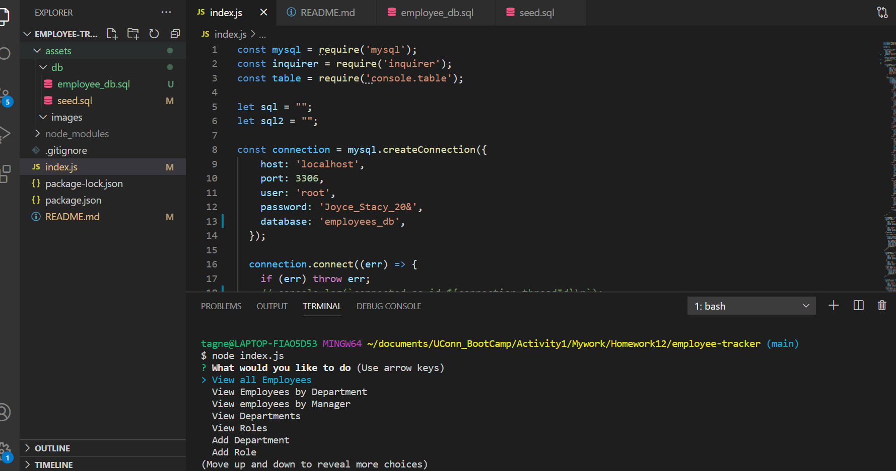

# employee-tracker

 

  ## Table of Content 

  * [Description](#descripton) 
  * [Installation](#installation) 
  * [Usage](#usage) 
  * [Guidlines](#guidlines) 
  * [Screenshots](#guidlines) 
  * [Project Links](#guidlines) 
  * [License](#license) 
  * [Contact](#contact) 
    
## Description

  The purpose of this project is to architect and build a solution for managing a company's employees using node, inquirer, and MySQL.

## Installation
    
Install the inquier, msql and the console.table packages
    
## Usage
    
    The app can help view and manage the departments, roles, and employees in a company
So that the user can organize and plan his .

## Technologie Used

    Node.js, npm, Javascript, inquirer, mysql, console.table
    
## Guidlines
    
    It is an open app and all contribution are welcome.

## Screenshots

## Project Links

[Video Link](https://drive.google.com/file/d/1RNRY72C-aEL7RUa_rf0UzuAMnCfAtKIy/view)

[Github Repository](https://github.com/AlCharl88/employee-tracker)
    
## License
    
    MIT License
    
##  Contact
 
[Github](https://github.com/AlCharl88) 
[Email](mailto:alctagne@gmail.com) 

    

----

&copy; 2021 Alain Tagne
